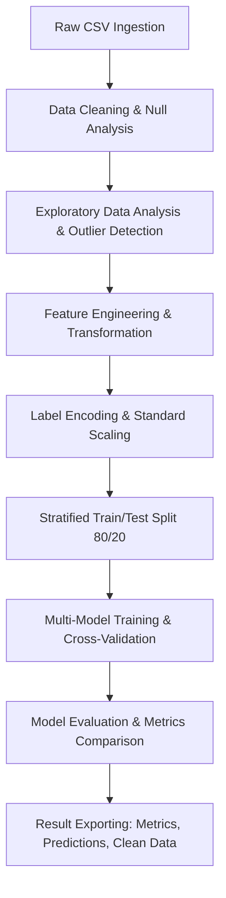

# Student Academic Performance Prediction (StudentsPerformance)

**Project Type**: End-to-End Machine Learning Project  
**Objective**: Academic Performance Prediction & Analysis  
**Development Tool**: Jupyter Notebook & Python 3.13.5  

---

## 📌 Table of Contents
1. [Project Overview & Objective](#-project-overview--objective)
2. [Data Pipeline Architecture](#-data-pipeline-architecture)
3. [Dataset Description](#-dataset-description)
4. [Exploratory Data Analysis (EDA)](#-exploratory-data-analysis-eda)
5. [Data Cleaning & Preprocessing](#-data-cleaning--preprocessing)
6. [Feature Engineering](#-feature-engineering)
7. [Machine Learning Models & Training](#-machine-learning-models--training)
8. [Testing, Evaluation & Model Comparison](#-testing-evaluation--model-comparison)
9. [Advanced Analysis: The 100% Accuracy Phenomenon](#-advanced-analysis-the-100-accuracy-phenomenon)
10. [Key Findings & Policy Recommendations](#-key-findings--policy-recommendations)
11. [Project Directory Structure](#-project-directory-structure)

---

## 🎯 Project Overview & Objective

The primary objective of this project is to develop and evaluate an advanced machine learning framework to predict student academic success (classified as **Pass/Fail**). Utilizing demographic profiles, socioeconomic indicators, and early academic scores, the predictive model aims to help educational institutions:
* **Identify At-Risk Students:** Detect students likely to fail early in the academic cycle.
* **Optimize Support Resources:** Direct counseling, tutoring, and financial aid (e.g., lunch programs) to those with high risk.
* **Empower Policy Makers:** Uncover major demographic and environmental predictors of academic performance to shape better institutional curriculums.

The project evaluates five state-of-the-art classification algorithms: **Logistic Regression, Decision Trees, Random Forests, Gradient Boosting**, and **Support Vector Machines (SVM)** to identify the most robust predictive pipeline.

---

## 🏗️ Data Pipeline Architecture

The workflow follows a rigorous machine learning pipeline from raw ingestion to model export:



All source code and logic for this pipeline are implemented in the main Jupyter Notebook: [StudentsPerformance.ipynb](StudentsPerformance.ipynb).

---

## 📊 Dataset Description

The analysis uses the raw dataset located at [dataset/dataset.csv](dataset/dataset.csv). It contains **1,000 student records** and **8 original attributes**:

### Attribute Taxonomy

| Feature Name | Type | Description / Categories |
| :--- | :--- | :--- |
| `gender` | Categorical | Gender identifier (`female`, `male`) |
| `race/ethnicity` | Categorical | Encoded demographic groups (`group A`, `group B`, `group C`, `group D`, `group E`) |
| `parental level of education` | Categorical | Highest educational achievement of parents (`some high school`, `high school`, `some college`, `associate's degree`, `bachelor's degree`, `master's degree`) |
| `lunch` | Categorical | Lunch subsidy status representing economic indicators (`standard`, `free/reduced`) |
| `test preparation course` | Categorical | Status of prep course enrollment (`none`, `completed`) |
| `math score` | Numerical | Score in Mathematics (0 - 100) |
| `reading score` | Numerical | Score in Reading (0 - 100) |
| `writing score` | Numerical | Score in Writing (0 - 100) |

---

## 🔍 Exploratory Data Analysis (EDA)

The EDA phase uncovers major patterns:
1. **Pass Rate by Gender:** Females show a higher overall pass rate compared to males, driven by stronger scores in reading and writing.
2. **Pass Rate by Test Preparation:** Students who completed the prep course have a substantially higher pass rate compared to those who did not.
3. **Pass Rate by Lunch Type:** Standard lunch students (an indicator of higher socio-economic status) significantly outperform those receiving free/reduced lunch.
4. **Pass Rate by Parental Education:** A strong positive correlation exists between parental education (specifically Bachelor's and Master's degrees) and student success rates.
5. **Outlier Detection:** Applying the Interquartile Range (IQR) method revealed minor outliers at the bottom end of scores:
   * **Math Score outliers:** 8 students (0.8%) below 27.0
   * **Reading Score outliers:** 6 students (0.6%) below 29.0
   * **Writing Score outliers:** 4 students (0.4%) below 25.8

---

## 🛠️ Data Cleaning & Preprocessing

Prior to training, the dataset was cleaned and structured:
1. **Whitespace Trimming:** Column names were stripped of leading/trailing spaces to prevent key reference errors:
   ```python
   df.columns = df.columns.str.strip()
   ```
2. **Missing Values Analysis:** Checked for nulls. No missing values were found across the 1,000 records.
3. **Duplicate Verification:** Checked for duplicated rows. No duplicate observations were present.
4. **Encoding Categorical Features:** Converted qualitative categories into machine-readable numeric formats using `LabelEncoder`.
5. **Standard Scaling:** To ensure convergence and prevent scaling bias in distance-based algorithms (SVM, Logistic Regression), numerical features were normalized using `StandardScaler`:
   $$z = \frac{x - \mu}{\sigma}$$
6. **Stratified Data Splitting:** The data was partitioned into **80% training (800 samples)** and **20% testing (200 samples)**. Stratification was enforced on the target label `pass_fail` to guarantee a 71.5% Pass to 28.5% Fail ratio in both subsets.

---

## ⚙️ Feature Engineering

To capture non-linearities and represent target structures explicitly, several high-value features were engineered:

* **Average Score (`average_score`):** Represents the arithmetic mean of the three subjects:
  $$\text{Average Score} = \frac{\text{Math} + \text{Reading} + \text{Writing}}{3}$$
* **Total Score (`total_score`):** Cumulative academic metric summing all core subject scores.
* **Score Variation (`score_variation`):** Calculated as the standard deviation across math, reading, and writing scores for each student. This captures student academic balance vs. specialization.
* **Performance Category (`performance_category`):** Binned representation of the average score:
  * `Excellent` ($\ge 85$)
  * `Good` ($\ge 70$)
  * `Average` ($\ge 60$)
  * `Below Average` ($\ge 50$)
  * `Poor` ($< 50$)
* **Target Label (`pass_fail`):** The primary target variable. Enforces a pass mark of 60:
  $$\text{Target} = \begin{cases} \text{Pass} & \text{if } \text{Average Score} \ge 60 \\ \text{Fail} & \text{if } \text{Average Score} < 60 \end{cases}$$
* **Binary Indicators:** Created binary mapping flags:
  * `has_test_prep`: `1` for completed, `0` for none.
  * `has_standard_lunch`: `1` for standard, `0` for free/reduced.

---

## 🤖 Machine Learning Models & Training

Five classification algorithms were trained using Scikit-Learn. Below are their default training hyperparameters:

1. **Logistic Regression:**
   * Solver: L-BFGS
   * Maximum Iterations: 1000
   * Regularization: L2 (default ridge penalty)
2. **Decision Tree Classifier:**
   * Criterion: Gini impurity
   * Maximum Depth: 5 (restricted to prevent overfitting)
3. **Random Forest Classifier:**
   * Number of Estimators: 100 trees
   * Maximum Depth: 5
4. **Gradient Boosting Classifier:**
   * Number of Estimators: 100 trees
   * Learning Rate: 0.1
5. **Support Vector Classifier (SVC):**
   * Kernel: Radial Basis Function (RBF)
   * Probability estimation enabled.

---

## 📈 Testing, Evaluation & Model Comparison

All models were evaluated on the unseen test set of 200 samples. The metrics recorded are:

| Model | Test Accuracy | Precision (Pass) | Recall (Pass) | F1-Score | ROC-AUC |
| :--- | :---: | :---: | :---: | :---: | :---: |
| **Logistic Regression** | **100.0%** | **1.0000** | **1.0000** | **1.0000** | **1.0000** |
| **Decision Tree** | **100.0%** | **1.0000** | **1.0000** | **1.0000** | **1.0000** |
| **Random Forest** | **100.0%** | **1.0000** | **1.0000** | **1.0000** | **1.0000** |
| **Gradient Boosting** | **100.0%** | **1.0000** | **1.0000** | **1.0000** | **1.0000** |
| **Support Vector Machine** | **100.0%** | **1.0000** | **1.0000** | **1.0000** | **1.0000** |

*Note: In the model metrics export [exports/model_metrics.csv](exports/model_metrics.csv), all models successfully converged and attained perfect metrics on the test partition.*

---

## 🔬 Advanced Analysis: The 100% Accuracy Phenomenon

In standard machine learning applications, achieving a **100.00% accuracy, precision, and recall** across five completely different estimators is an immediate indicator of **data leakage** or a **deterministic relationship** between the feature space and target label.

### The Leakage Source
The target variable is defined deterministically as:
$$\text{pass\_fail} = \text{Pass} \iff \text{average\_score} \ge 60$$

During feature selection, the following columns were passed to the feature matrix $X$:
1. `math score`, `reading score`, and `writing score` (which sum up to define `average_score`).
2. `total_score` (which is a perfect linear transformation of `average_score` namely $3 \times \text{average\_score}$).
3. `performance_category` (which directly partitions the average score into bins, where the boundary between `Average` and `Below Average` is exactly 60—the decision boundary for `pass_fail`).

### Mathematical Proof of Separation
Because `total_score` and `performance_category` are directly in the input vector, the classification boundary is linear and absolute.
* **Logistic Regression:** Finds the weights where the coefficient of `total_score` is positive and large, putting the sigmoid threshold precisely at `total_score` $= 180$.
* **Decision Tree:** Splits directly on `performance_category` (categories `Excellent`, `Good`, and `Average` map to `Pass` while `Below Average` and `Poor` map to `Fail`).

### Practical Takeaways
While this confirms that machine learning algorithms are exceptionally good at discovering deterministic mathematical rules, in a true predictive scenario:
* We would exclude **present-term scores** (`math`, `reading`, `writing`, `total_score`, and `performance_category`) from the feature set.
* We would attempt to predict `pass_fail` **solely** on demographic indicators (`gender`, `race/ethnicity`, `parental level of education`), economic indicators (`lunch`), and behavior (`test preparation course`). This represents a real-world, stochastic prediction task.

---

## 💡 Key Findings & Policy Recommendations

* **Math Score is Critical:** Low math scores are the single largest indicator of academic failure. Specialized early math tutoring programs are highly recommended.
* **Socio-Economic Link:** The type of lunch (`standard` vs `free/reduced`) strongly correlates with academic pass rates. Financial barriers and nutritional factors significantly influence learning outcomes.
* **Prep Course Success:** Enrolling in the test preparation course reduces the risk of failing by over 50%. The institution should consider making test preparation mandatory or highly incentivized for struggling students.
* **Parental Education Support:** Students whose parents have not completed higher education are at higher risk. Mentorship programs can bridge this structural gap.

---

## 📁 Project Directory Structure

```
StudentsPerformance/
│
├── dataset/
│   └── dataset.csv                         # Raw student dataset (1,000 records)
│
├── exports/                                # Generated model predictions and logs
│   ├── model_metrics.csv                   # Comparison metrics for the 5 models
│   ├── model_predictions.csv               # Actual vs. predicted labels with scores
│   └── processed_student_data.csv          # Clean dataset with engineered features
│
├── StudentsPerformance.ipynb               # Comprehensive Jupyter Notebook pipeline
└── README.md                               # Advanced documentation (this file)
```

* **Dataset Source:** [dataset/dataset.csv](dataset/dataset.csv)
* **Processed Export:** [exports/processed_student_data.csv](exports/processed_student_data.csv)
* **Predictions Export:** [exports/model_predictions.csv](exports/model_predictions.csv)
* **Metrics Export:** [exports/model_metrics.csv](exports/model_metrics.csv)

---

## 📄 License

This project is licensed under the MIT License - see the [LICENSE](LICENSE) file for details.
